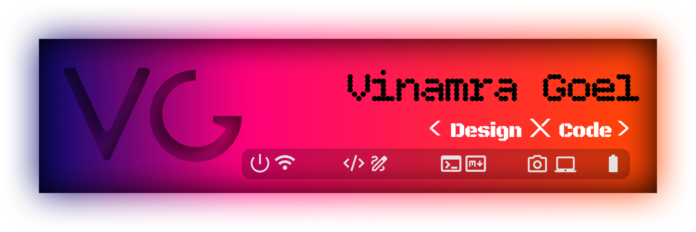

  
  

  <h2> Hi, I'm Vinamra Goel 👋</h2>

  *B.Tech CSE Student · Designer · Developer*

  ---

  *I design with intention and build with purpose — blending clean aesthetics with functional tools to create experiences that make people more productive.*

---

## 🧑‍💻 About Me

- 🎓 Pursuing **B.Tech in Computer Science** at UPES, Dehradun
- 🎨 Passionate about the intersection of **design and development**
- 🌐 Currently learning **Web Development** (HTML, CSS & JavaScript)
- ⚡ I believe good design isn't just how it looks — it's how well it works

---

## 🛠️ Skills & Tech Stack

**Languages**

Python · C · SQL · JavaScript *(learning)* · HTML *(learning)*

**Design Tools**

Figma · Canva · Adobe Creative Cloud

---

## 🔗 Connect with Me

[LinkedIn — linkedin.com/in/vinamra-goel](https://www.linkedin.com/in/vinamra-goel)

---

  Crafted with focus & simplicity ✦

